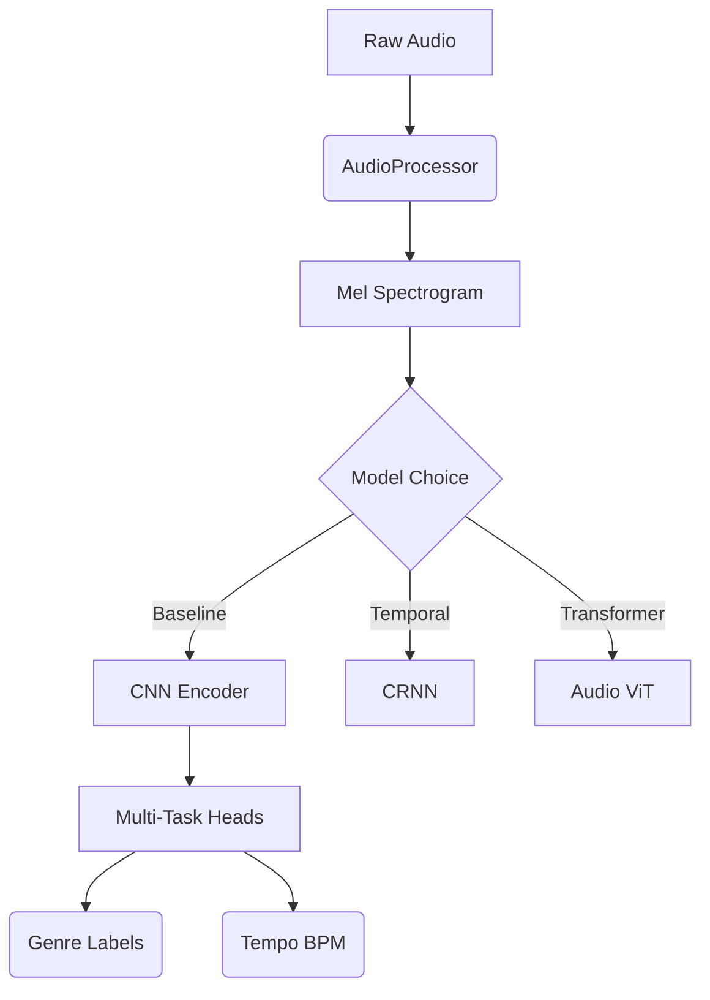

# FluxBeat 🎵🌊


**FluxBeat** is a state-of-the-art, deep-learning-based music genre classification system. Unlike traditional classifiers that assign a single label to an entire song, FluxBeat recognizes that music is fluid. It uses **multi-label classification** and **temporal modeling** (CRNN, transformers) to understand how genres evolve within a track.

## 🚀 Key Features

- **Multi-Label Support**: Predicts multiple genres for complex tracks (e.g., "Indie Rock" + "Folk").
- **Temporal Modeling**:
  - **CRNN**: Combines CNNs with Bi-Directional LSTMs to capture time-series evolution.
  - **Audio Transformer**: Vision Transformer (ViT) adapted for audio spectrograms.
- **Explainable AI (XAI)**: Integrated **Grad-CAM** engine to visualize exactly what frequencies and time segments the model focuses on.
- **Multi-Task Learning**: Simultaneously predicts **Genre** (Classification) and **Tempo/BPM** (Regression).
- **Self-Supervised Learning**: Includes **SimCLR** capabilities for pretraining on unlabeled data.
- **Real-Time API**: High-performance **FastAPI** server with sliding-window inference for full-track analysis.

## 🏗️ Architecture



## ⚡ Quick Start

### 1. Installation
```bash
git clone https://github.com/pronzzz/fluxbeat.git
cd fluxbeat
pip install -r requirements.txt
```

### 2. Run the API
Start the inference server immediately:
```bash
uvicorn src.api.server:app --reload
```
Open **[http://127.0.0.1:8000/docs](http://127.0.0.1:8000/docs)** to upload an MP3 and see the magic.

### 3. Model Zoo & Benchmarks
| Model | Parameters | Latency (CPU) | Description |
| :--- | :--- | :--- | :--- |
| **BaselineCNN** | 391k | ~1.5 ms | Lightweight, fast, good baseline. |
| **CRNN** | 2.6M | ~4.5 ms | Captures temporal dynamics. Slower but robust. |
| **AudioTransformer** | 3.2M | ~1.5 ms | State-of-the-art attention mechanism. |

## 📂 Project Structure
- `src/data`: Data loading, segmentation, caching, and augmentation.
- `src/models`: Model definitions (CNN, CRNN, Transformer, SSL, MultiTask).
- `src/utils`: Grad-CAM, visualization, metrics, benchmarking.
- `src/inference`: Sliding window inference engine.
- `src/api`: FastAPI server.

## 📖 Documentation
For detailed training, evaluation, and advanced usage instructions, see the **[User Guide](USER_GUIDE.md)**.

## 📜 License
This project is licensed under the MIT License - see the [LICENSE](LICENSE) file for details.

---
*Built with ❤️ by Pranav Dwivedi*
